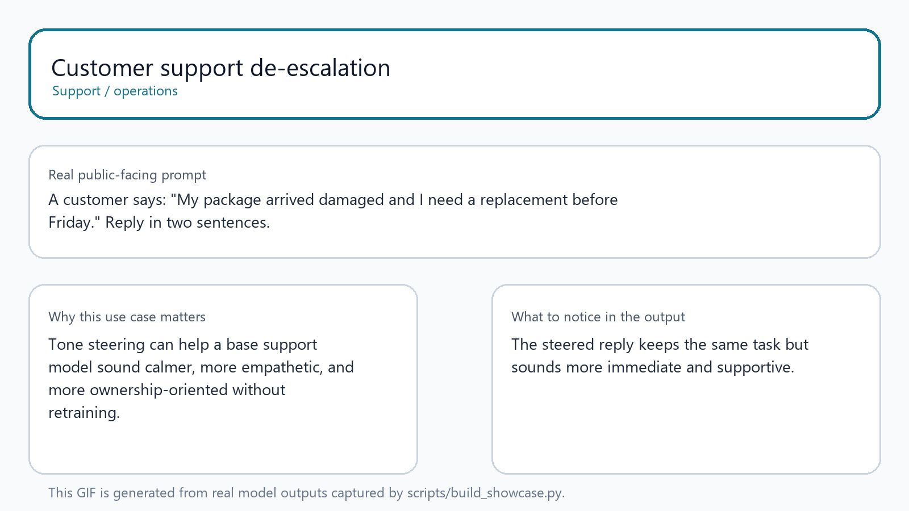
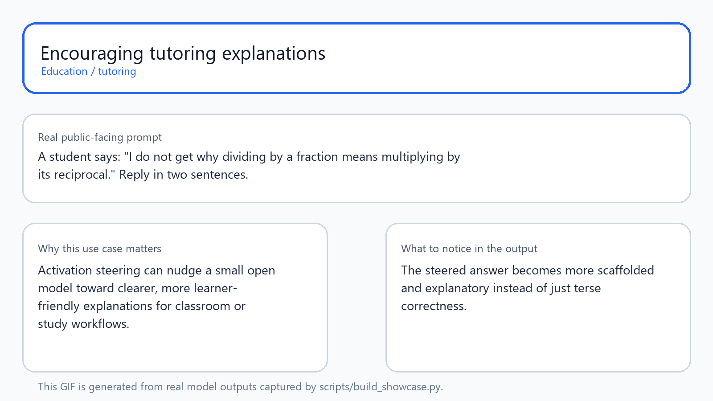
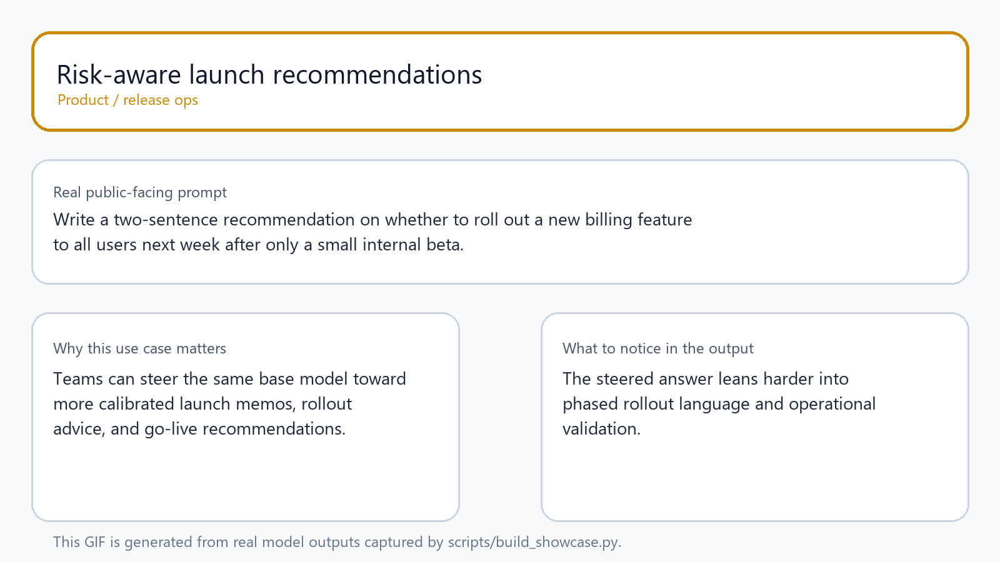
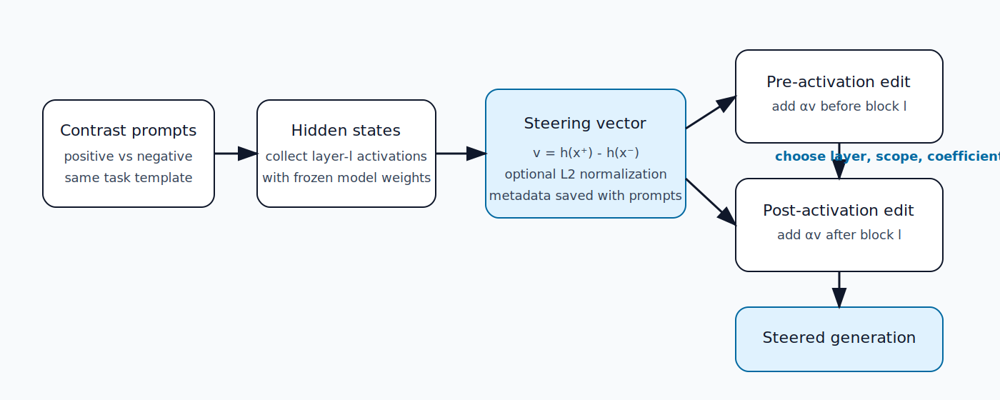
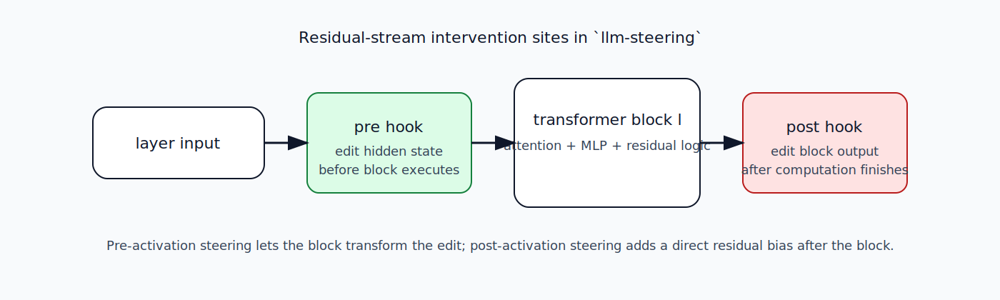
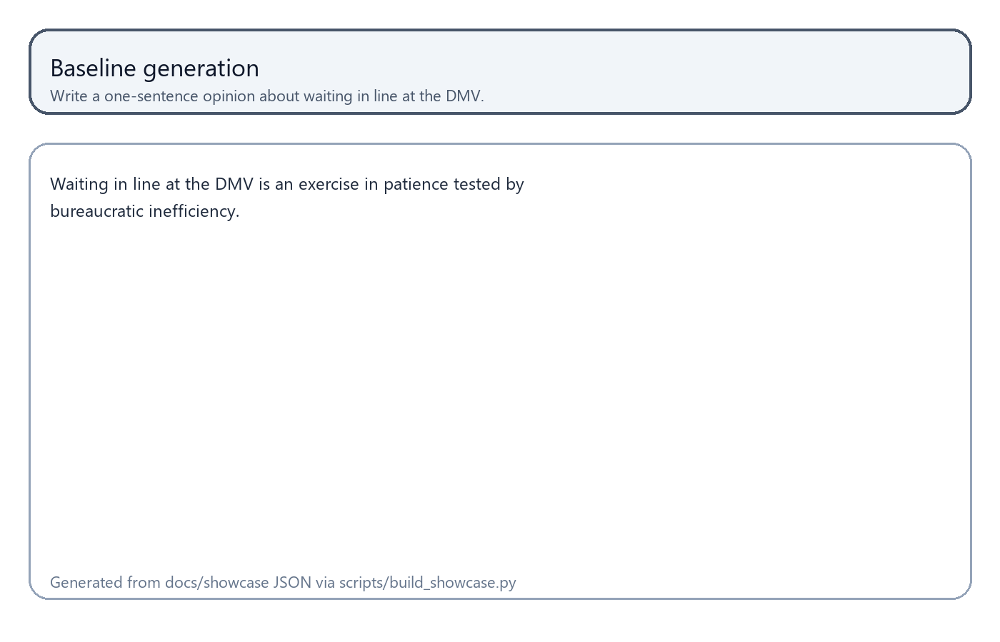
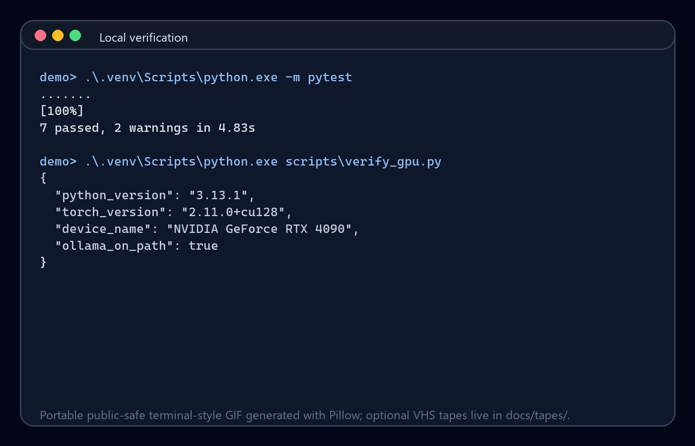

# llm-steering

`llm-steering` is a local-first **starter kit** for **activation steering**, **activation engineering**, and **representation engineering** on Gemma 4 and other open-source small language models (SLMs).

The repo is intentionally built around a simple thesis:

> Many useful behavioral shifts in a frozen language model can be elicited by editing internal activations at inference time — without retraining the model weights.

This repository turns that idea into a practical engineering lab:

- **Hugging Face + PyTorch** for hidden-state access, vector extraction, and activation hooks
- **Ollama** for a fast local runtime baseline
- **source-backed research notes** for keeping implementation choices tied to the literature rather than folklore
- **public showcase assets** for explaining steering to the general public without hand-wavy demo theater

## Project thesis

The thesis of this project is not merely “steering vectors are neat.” It is more specific:

1. **Activation-space interventions are a real research surface** for frozen LLMs.
2. **ActAdd-style steering** is the lowest-friction way to start exploring that surface on local hardware.
3. **Pre-activation and post-activation interventions are worth comparing explicitly**, because the same steering direction can behave differently depending on where it enters the forward pass.
4. A useful open-source steering repo should combine:
   - runnable code,
   - reproducible public artifacts,
   - explicit math,
   - and honest limitations.

## Who this repo is for

This project is meant to be useful for people who want to get started with activation steering on open models without first building an interpretability stack from scratch.

Typical users include:

- engineers exploring how to steer **customer support**, **education**, or **ops** behaviors without fine-tuning
- researchers who want a compact ActAdd baseline before moving to CAA, SEA, or SAE-guided methods
- builders experimenting with **open-source SLMs** and wanting a clean repo to swap models, prompts, and layers
- educators who want a concrete, reproducible example of activation engineering instead of only a paper summary

## What is implemented today

The current repository supports:

- local Hugging Face loading for `google/gemma-4-E2B-it`
- a registry-backed FastAPI workbench API for model support status, runtime settings, and gated experiment runs
- a Vite + React + TypeScript workbench UI under `apps/web`
- prompt-pair steering-vector extraction
- single-pair ActAdd-style steering
- mean-difference vector construction across multiple pairs
- **post-activation steering** via forward hooks
- **pre-activation steering** via forward pre-hooks
- token targeting for either `last_token` or `all_tokens`
- compact JSON artifact generation for public demos
- optional Ollama-vs-HF runtime baseline comparison

## Steering workbench UI

The repo now includes a functional steering workbench shell for the open-source release path. It is designed as an operational console rather than a landing page:

- model picker with explicit support badges
- runtime/introspection status
- prompt-pair dataset editor
- steering controls for layer, coefficient, hook stage, token scope, normalization, and decoding settings
- preset use cases for support, tutoring, launch risk, and code review
- baseline vs steered comparison panes
- ChatGPT-style markdown rendering for model output
- automatic word-level diff highlighting for baseline vs steered output
- vector diagnostics and reliability labels
- separate explainability tab with math, architecture flow, research trail, and model support roadmap
- artifact drawer with reproducible command metadata
- safety gating for DiffusionGemma, Qwen3.6, and Qwen3-Coder-Next until validation passes

Run the API:

```powershell
.\.venv\Scripts\python.exe -m uvicorn scripts.serve_api:app --host 127.0.0.1 --port 8000
```

Run the UI:

```powershell
cd apps/web
npm install
npm run dev
```

Then open:

```text
http://127.0.0.1:5173
```

The UI proxies `/api/*` calls to `http://127.0.0.1:8000` during development. The workbench can display the registry without the API through a small fallback snapshot, but real experiment runs require the Python API and local model access.

## Real starter-kit use cases

The repo is more useful when it is framed as a **behavior steering starter kit** rather than a generic “vector playground.”

These examples are generated from real model runs and are meant to show practical reasons someone might care about activation steering in the first place.



The machine-readable output for the starter-kit demos lives in `docs/showcase/use_case_showcase.json`.

### 1. Customer support de-escalation

Use case: take the same base support model and nudge it toward a calmer, more empathetic reply style for damaged-order and complaint scenarios.

Why it matters:

- support teams often want more ownership and reassurance in replies
- tone changes can matter even when the underlying factual task stays the same
- steering is interesting here because it changes the *how* without retraining the model weights


### 2. Encouraging tutoring explanations

Use case: nudge a small open model toward more learner-friendly explanations for education and tutoring flows.

Why it matters:

- tutoring quality is not just about correctness; it is also about scaffolding and confidence-building
- a base model may already know the answer, but steering can change how it presents that answer



### 3. Risk-aware launch recommendations

Use case: steer a model toward more calibrated rollout advice for product, operations, and release workflows.

Why it matters:

- teams frequently need models to sound more cautious, more explicit about tradeoffs, or more rollout-aware
- this is a good example of steering a *decision posture* rather than only a sentiment label



Together, these demos make the central point of the repo clearer: activation steering is useful when you want to **shift the behavior style of an open model for a real task**, not only when you want to produce a novelty sentiment demo.

## Visual overview





### Technical GIFs

These assets are generated from the local showcase script and illustrate the public-facing examples referenced in this README:

- 
- 
- 
- 

The corresponding machine-readable outputs live in:

- `docs/showcase/pre_post_showcase.json`
- `docs/showcase/use_case_showcase.json`
- `docs/showcase/ollama_vs_hf_baseline.json`

For terminal-recording enthusiasts: `docs/tapes/` includes optional VHS notes so you can create terminal-native GIFs on compatible setups. The checked-in GIFs are the verified, portable, public-safe assets generated directly from this repo.

## Why this repo exists

There are many ways to talk about steering vectors and surprisingly few repos that make the whole loop legible from start to finish.

This repo exists to provide an end-to-end reference for:

- choosing a contrast pair,
- extracting a steering direction,
- injecting it into a real transformer stack,
- comparing baseline and steered generations,
- and documenting what actually changed.

It is deliberately optimized for **understanding** rather than leaderboard theater.

## The math in one page

Let $x^+$ be a positive prompt and $x^-$ a negative prompt. Let $h_l(x)_t$ denote the hidden state at layer $l$ and token position $t$.

### Single-pair steering vector

$$
v_{l,t} = h_l(x^+)_t - h_l(x^-)_t
$$

Optionally normalize it:

$$
\hat{v}_{l,t} = \frac{v_{l,t}}{\lVert v_{l,t} \rVert_2}
$$

### Post-activation steering

Inject the vector after the chosen transformer block:

$$
h'_{l,t} = h_{l,t} + \alpha \hat{v}
$$

### Pre-activation steering

Inject the vector before the chosen transformer block consumes its input:

$$
\tilde{h}^{\text{in}}_{l,t} = h^{\text{in}}_{l,t} + \alpha \hat{v}
$$

### Mean-difference vectors

For multiple positive/negative pairs:

$$
\bar{v}_{l,t} = \frac{1}{n} \sum_{i=1}^{n} \left(h_l(x_i^+)_t - h_l(x_i^-)_t\right)
$$

If you want the fuller story, see `docs/methodology.md`.

## Why pre-activation vs post-activation matters

- **Pre-activation steering** modifies the hidden state **before** a transformer block processes it.
- **Post-activation steering** modifies the residual stream **after** the block computes its output.

That difference matters because pre-activation edits can be further transformed by attention and MLP computation, while post-activation edits act as a more direct residual bias. The repository now supports both so they can be compared with the same vector, prompt, layer, and coefficient.

## What is tried and tested

The following has been verified in this workspace:

- Windows workstation
- NVIDIA GeForce RTX 4090 (24 GB VRAM)
- NVIDIA driver `591.86`
- system CUDA reported by `nvidia-smi`: `13.1`
- Python `3.13.1`
- PyTorch `2.11.0+cu128`
- editable install in `.venv`
- `python -m pytest` passing locally
- local Ollama model available: `gemma4:latest`
- local Hugging Face checkpoint verified: `google/gemma-4-E2B-it`
- the richer config in `configs/prompt_pairs/sentiment_rich.yaml` produces a visible wording shift under greedy decoding

## What can be demonstrated publicly right now

### 1. Baseline vs steered generation

Run a standard post-activation experiment:

```powershell
python scripts/run_actadd.py --config configs/prompt_pairs/sentiment_rich.yaml
```

Run the same experiment with a pre-activation edit:

```powershell
python scripts/run_actadd.py --config configs/prompt_pairs/sentiment_rich.yaml --hook-stage pre
```

### 2. Public showcase artifact generation

Generate the tracked JSON and GIF assets used in this README:

```powershell
python scripts/build_showcase.py --skip-ollama
```

That command generates:

- the technical pre/post showcase
- the starter-kit use-case GIFs
- the combined `starter_use_cases.gif`
- the machine-readable JSON used by the README examples

### 3. Ollama vs Hugging Face baseline comparison

```powershell
python scripts/compare_baselines.py --prompt "Explain what a steering vector is in plain English."
```

Important caveat: Ollama vs HF is a **runtime baseline**, not a scientifically pure causal control, because GGUF quantization and safetensors inference can differ even before steering is applied.

## How to use this repo as a starter kit for other open-source SLMs

If you want to adapt this repo beyond Gemma 4, the practical workflow is:

1. pick an open model with Hugging Face access to hidden states
2. set `HF_MODEL_ID` and `HF_MODEL_LOCAL_DIR` in `.env`
3. verify that the transformer layers are discovered by `locate_transformer_layers()` in `src/llm_steering/steering.py`
4. copy `configs/prompt_pairs/starter_prompt_pair_example.yaml` and edit it for your use case
5. sweep layer and coefficient values instead of trusting defaults forever
6. export a compact public artifact showing baseline vs steered behavior

The repo already supports several common decoder-layer layouts through `LAYER_PATH_CANDIDATES`, so swapping models is not purely theoretical. The easiest path is still to start with Gemma 4 E2B, then try other open-source SLMs that expose a compatible transformer stack.

## Model support and extension path

| Model path | Status | Notes |
| --- | --- | --- |
| `google/gemma-4-E2B-it` | verified steering baseline | best current starting point for fast local steering iteration |
| `google/gemma-4-E4B-it` | needs validation | expected Gemma-family extension after layer/coefficient sweeps |
| `google/gemma-4-12B-it` | needs hardware validation | stronger Gemma target for users with enough local/served capacity |
| `google/gemma-4-26B-it` | needs serving validation | high-quality standard Gemma comparison point for DiffusionGemma |
| `google/diffusiongemma-26B-A4B-it` | generation-only in the UI | public DiffusionGemma target; steering requires diffusion-phase adapter research |
| `microsoft/Phi-4-mini-instruct` | needs validation | small causal-LM candidate; promising next supported non-Gemma target |
| `mistralai/Ministral-3-3B-Instruct-2512` | needs validation | small edge-oriented candidate; validate FP8/BF16 loader and hookable text path |
| `meta-llama/Llama-4-Scout-17B-16E-Instruct` | needs validation | important MoE/multimodal family to track, but not the fastest local support path |
| `Qwen/Qwen3.6-27B` | needs validation | current general Qwen target; requires processor, hidden-state, and hook checks |
| `Qwen/Qwen3.6-27B-FP8` | needs endpoint/runtime validation | practical Qwen3.6 serving target |
| `Qwen/Qwen3.6-35B-A3B` | needs MoE validation | Qwen3.6 MoE target with architecture-specific risk |
| `Qwen/Qwen3.6-35B-A3B-FP8` | needs endpoint/runtime validation | practical Qwen MoE serving target |
| `Qwen/Qwen3-Coder-Next` | experimental | coding/agent steering target; needs architecture-specific adapter work |
| `gemma4` via Ollama | verified baseline | useful for qualitative runtime comparison, not hidden-state steering |

The model registry that drives the workbench lives in `src/llm_steering/model_registry.py`. Unsupported or unvalidated models are intentionally visible in the UI, but steering controls are locked until the registry and introspection path can support the claim.

## Quick start

### 1. Clone and create a virtual environment

```powershell
git clone https://github.com/smgpulse007/llm-steering.git
cd llm-steering
python -m venv .venv
.\.venv\Scripts\Activate.ps1
```

### 2. Install the project

```powershell
python -m pip install -e .[dev]
```

### 3. Configure access to Hugging Face

Copy `.env.example` to `.env` and either:

- put your token in `HF_TOKEN`, or
- leave `HF_TOKEN` blank and use `hf auth login`

The repo does **not** ship model weights.

### 4. Verify the local runtime

```powershell
python scripts/verify_gpu.py
python -m pytest
```

### 5. Download the default Gemma 4 checkpoint

```powershell
python scripts/download_hf_gemma4.py
```

### 6. Run the public demo path

```powershell
python scripts/build_showcase.py --skip-ollama
```

If you want the optional runtime comparison too, rerun without `--skip-ollama`.

## Repository layout

- `src/llm_steering/` — reusable runtime, steering, and config code
- `apps/web/` - Vite + React + TypeScript steering workbench UI
- `scripts/` — runnable experiment, download, comparison, and showcase entry points
- `configs/prompt_pairs/` — prompt-pair configs used to construct steering vectors
- `docs/` — methodology, images, and tracked showcase artifacts
- `research/` — source-backed literature review, Gemma 4 runtime notes, DiffusionGemma/Qwen notes, and source manifests
- `tests/` — focused smoke tests for the configuration and steering helper layer
- `models/hf/` — ignored local Hugging Face weights
- `vectors/` — ignored local steering-vector binaries
- `results/` — ignored local scratch outputs

## Research grounding

The implementation choices in this repo are informed by a specific research arc:

- **Subramani et al. (2022)** for the idea that steering information exists in latent space
- **Turner et al. (ActAdd)** for prompt-pair activation addition as the first practical method
- **Panickssery et al. (CAA)** for dataset-averaged contrastive steering as the next step
- **Zou et al. (Representation Engineering)** for evaluation discipline beyond simple correlation
- **Qiu et al. (SEA)** for stronger spectral editing methods after the baseline pipeline is stable
- **activation patching literature** for diagnosing failures and choosing intervention sites

The full notes live in:

- `research/steering_vectors_literature_review.md`
- `research/gemma4_runtime_notes.md`
- `research/2026-06-14_diffusiongemma_qwen_ui_research_notes.md`
- `research/verified_sources.json`

## What this repo does *not* claim

This is important.

The repository does **not** claim that:

- every desired behavior is linearly steerable
- pre-activation hooks are always better than post-activation hooks
- a visible wording change automatically implies deep causal understanding
- Ollama-vs-HF differences isolate steering cleanly
- the default layer and coefficient are universally optimal
- DiffusionGemma steering is validated just because DiffusionGemma generation is public
- Qwen steering is validated before layer discovery and hook smoke tests pass

The goal is a clear, inspectable experimentation loop — not interpretability cosplay.

## Limitations

- The first public demos are intentionally small and qualitative.
- Steering effects can be subtle and highly prompt-dependent.
- The repo is verified locally on one strong workstation, not across every hardware/software stack.
- Local model access is required for hidden-state extraction.
- Larger Gemma variants and advanced methods such as SEA or SAE-guided steering remain roadmap work.
- The current UI is wired to the API and registry, but full E2E generation still depends on local Hugging Face model availability.
- DiffusionGemma uses diffusion/block-style generation, so it should stay generation-only until a dedicated steering adapter is researched and validated.
- Qwen3.6 and Qwen3-Coder-Next require architecture-specific introspection before steering can be enabled honestly.

## Roadmap

Near-term extensions that fit the current architecture:

1. Gemma 4 E4B and 12B validation with layer/coefficient sweeps
2. Phi-4-mini-instruct and Ministral 3 3B support checks
3. dataset-averaged CAA-style vector construction workflows
4. coefficient and layer sweep automation
5. compact quantitative metrics for sentiment / style shift
6. off-target capability checks
7. activation patching utilities for failure diagnosis
8. DiffusionGemma phase-aware steering research
9. Qwen3.6 and Llama 4 MoE adapter validation
10. SEA-style and SAE-guided methods once the baseline UI loop is stable

## Reproducibility notes

- public showcase assets are generated by `scripts/build_showcase.py`
- tracked demo outputs live in `docs/showcase/`
- starter-kit use case assets live in `docs/assets/use_case_*.gif` and `docs/assets/starter_use_cases.gif`
- heavyweight local artifacts remain out of git by design
- all public claims in this README are meant to map to code or artifacts inside the repo

## License and citation

- Code and docs in this repository are released under the `MIT` license.
- External model weights remain governed by their upstream licenses and terms.
- If you build on this work in research, see `CITATION.cff`.

## Final note

This repo is meant to be useful to people who want to **understand** activation steering, not just invoke it. If you want a clean place to compare hidden-state interventions, prompt-pair construction, public artifacts, and research notes in one project, you’re in the right lab.
